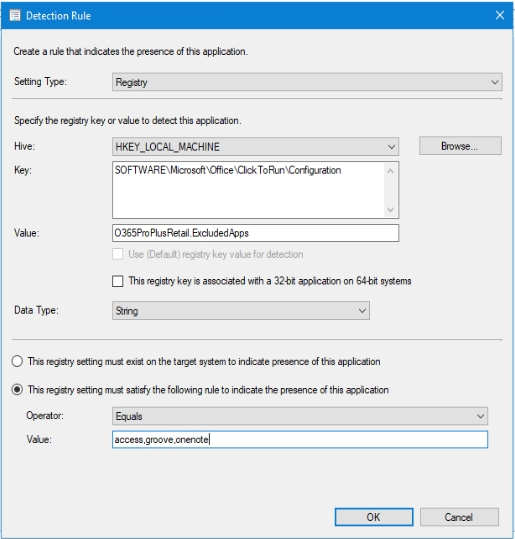
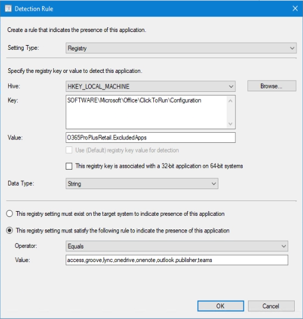
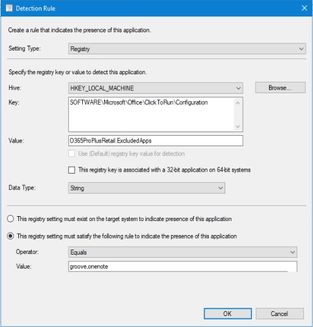
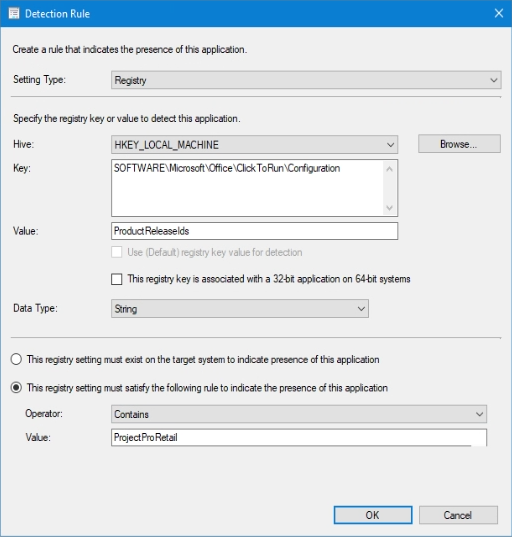

At the client I'm currently working for, we have **FIVE** different deployments of Office 365 Client within Microsoft Enterprise Configuration Manager. The business decided that they only wanted users to have exactly what was needed. Essentially, this is the legacy approach to Office deployment in the MSI days where you could fully customise which components were installed and was easy to add bits back in at a later date.  
These are the options they wanted:

1. Standard Office: Without Access, Groove, OneNote 2016
2. Kiosk Office: Only Word,Excel, and PowerPoint
3. Add Access
4. Add Visio Online
5. Add Project Online

The reason for excluding Access, as I expect with most companies, is because it's regarded best practice to never give it to users in case they create dirty little database apps, tie them into business processes, then promptly get hit by a bus. Then the business expects IT to support it... somehow. However, there are circumstances when a user or two *may* be trusted to use Access without developing some bespoke monstrosity - Though, I'd strongly recommend HR/Legal get involved to ensure whatever the user does in Access **never** ends up being an IT problem!

The Kiosk install, as the name implies, is because there are computers offshore that have generic logins used for Permit-to-work, so having OneDrive or Outlook would be a GDPR nightmare, so it's removed.

Then we have two separate deployments for Visio and Project. Despite trying to argue that they'll run in Read Only mode if a license isn't applied to the user, it did not matter and I just did what I was instructed like a good obedient contractor.

## Configuration Manager Deployment

Using the built-in Office 365 configuration builder, we generated config files for each deployment. Apart from Visio and Project, the config was the same with varying &lt;ExcludeApp ID="" /&gt; sections.

Visio and Project XML look like this:

Initially, the detection method used for Standard Office deployment was only looking in the O365 Configuration Registry `HKLM:\SOFTWARE\Microsoft\Office\ClickToRun\Configuration` for "`VersionToReport`" being Greater Than or Equal to 16.x.x.x.

However, when I came to do the 2nd application, I needed more than the version to detect the type of install - I opted for the values: "`VersionToReport`" and "`O365ProPlusRetail.ExcludedApps`".

So, in order to make each deployment unique, the detection methods had to be adjusted as follows:

1. Standard Office:
    `LocalMachine\SOFTWARE\Microsoft\Office\ClickToRun\Configuration\VersionToReport Greater than or equal to 16.0.11929.20606.`  
    and  
    `LocalMachine\SOFTWARE\Microsoft\Office\ClickToRun\Configuration\O365ProPlusRetail.ExcludedApps Equals access,groove,onenote.`  
    
1. Kiosk Office
    `LocalMachine\SOFTWARE\Microsoft\Office\ClickToRun\Configuration\VersionToReport Greater than or equal to 16.0.11929.20606.`    
    And  
    `LocalMachine\SOFTWARE\Microsoft\Office\ClickToRun\Configuration\O365ProPlusRetail.ExcludedApps Equals access,groove,lync,onedrive,onenote,outlook,publisher,teams.`
    
1. Add Access
    `LocalMachine\SOFTWARE\Microsoft\Office\ClickToRun\Configuration\VersionToReport Greater than or equal to 16.0.11929.20606.`  
    And  
    `LocalMachine\SOFTWARE\Microsoft\Office\ClickToRun\Configuration\O365ProPlusRetail.ExcludedApps Equals groove,onenote.`  
    
    **NB**: Visio and Project use a different registry key as they do not appear in `O365ProPlusRetail.ExcludedApps`. 
    This time we have to look in the registry value: `ProductReleaseIds` if it **contains** `VisioProRetail` or `ProjectProRetail` along with the `VersionToReport`.
1. Add Visio
    `LocalMachine\SOFTWARE\Microsoft\Office\ClickToRun\Configuration\VersionToReport Greater than or equal to 16.0.11328.20368.`
    And
    `LocalMachine\SOFTWARE\Microsoft\Office\ClickToRun\Configuration\ProductReleaseIds Contains ProjectProRetail.`
    
1. Add Project
    `LocalMachine\SOFTWARE\Microsoft\Office\ClickToRun\Configuration\VersionToReport Greater than or equal to 16.0.11328.20368.`
    And
    `LocalMachine\SOFTWARE\Microsoft\Office\ClickToRun\Configuration\ProductReleaseIds Contains ProjectProRetail.`
    

----

The standard Office is included in the OSD Task Sequence, so there is no active deployment of this Application.

The others are deployed to specific collections which computers get added to via AD groups.  
This allows the whole setup to be modular as requested.

The downsides of this approach are:

* Each deployment requires the entire Office 365 source to be downloaded to the client each time, which is a cool 2.5GB.
* You really need to start thinking about the detection logic if you want more options.  
  During testing, I managed to get a deployment loop of standard & kiosk.
* It's an administration time-sink you probably don't want.

Having done all this for the client and written about it, it got me wondering if it's perhaps better to install everything and look into AppLocker policies to restrict or allow access to certain Office executables... To the Lab!
