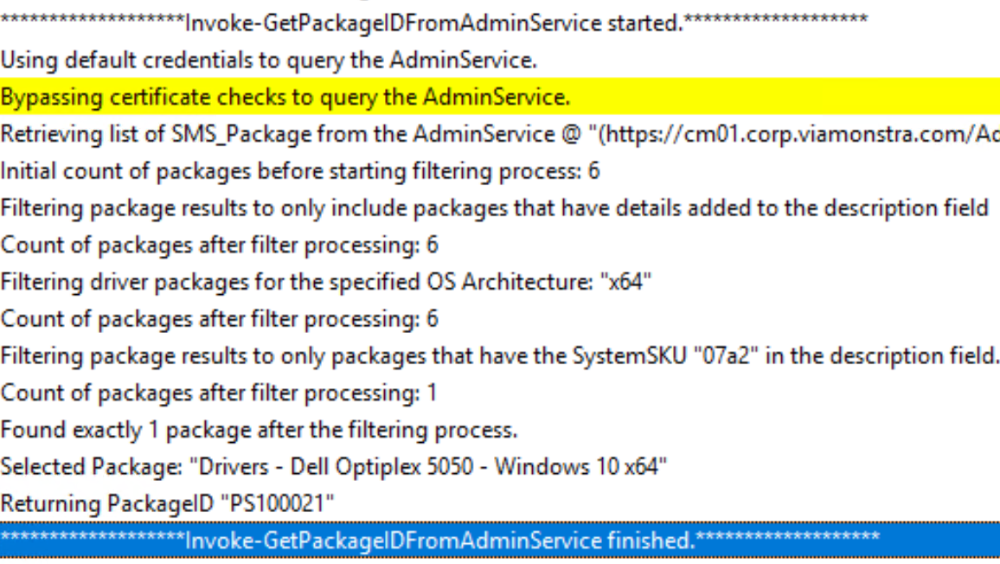
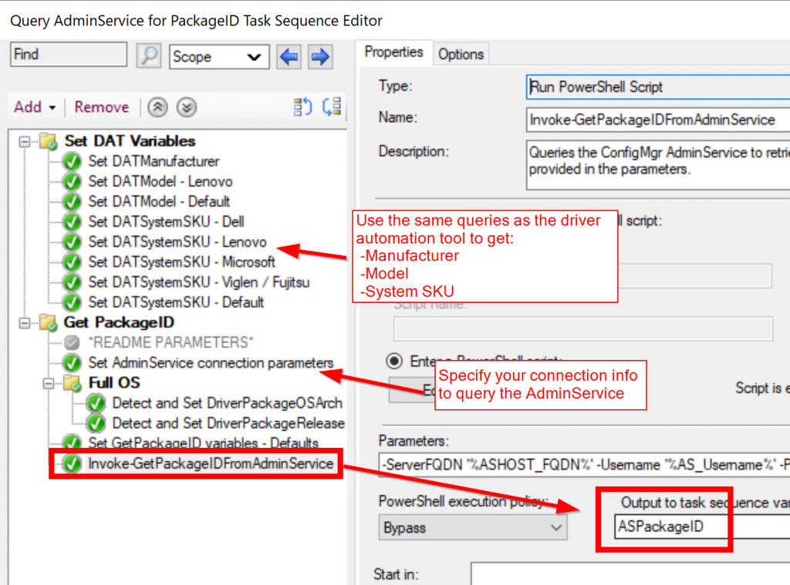
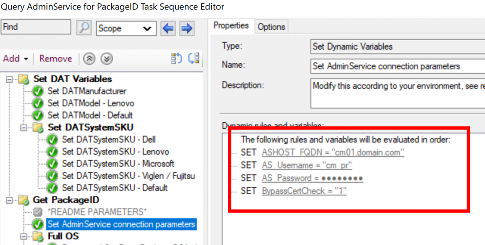
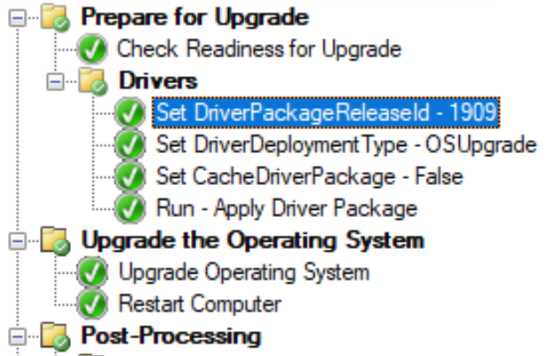

**2021-04-27 update: The solution now works over CMG. Please see this [post](https://sysmansquad.com/2021/04/27/updated-modern-driver-bios-management-with-cmg-support/) for details**.

Hello!

Today I’d like to share with you a new solution I’ve developed to allow me to use the free [Modern Driver Management solution from the team at MSEndpointMgr](https://msendpointmgr.com/modern-driver-management/) at my work. My goal is to use the process developed by them for managing drivers in a task sequence and convert it to use the ConfigMgr Administration Service since my company won't allow me to install their third-party web service. It will also move most of the functionality into task sequence steps to make it easier for admins to debug and make changes to the process. Links to my solution are provided below.

Here is a quick summary of their existing solution:

1. Use the Driver Automation Tool to download and create standard packages in Configuration Manager
2. Install and Configure the Web Service
3. Use the "ApplyDriverPackage" PowerShell script to:
    * Detect the device manufacturer, model and System SKU
    * Query the web service for a list of driver packages
    * Filter down to the best driver package for your system
    * Download the driver package
    * Apply the drivers

### What is the Administration Service?

The Administration Service (AdminService for short) is a REST API for the SMS_Provider that is accessible via HTTPS. It's a web service developed and maintained by the product team.

If you want to know more, check out the official documentation [here](https://docs.microsoft.com/mem/configmgr/develop/adminservice/overview).

#### Great, but how do I use this service?

Since I had no idea where to start initially to get some data back from the AdminService, I found some good blog articles and videos to guide me. Here is what helped me out the most:

* [A video about the Administration Service](https://www.youtube.com/watch?v=7oLL5F-L6As) by Steven Rachui
* [A collection of blog posts on the AdminService](https://www.asquaredozen.com/2019/02/12/the-system-center-configuration-manager-adminservice-guide/) by Adam Gross
* [Working with the AdminService – Reading Data](https://z-nerd.com/blog/2019/12/05-working-with-adminservice-and-odata/) by Nathan Ziehnert

### Step 1 - Replace the web service

The main “challenge” to replace the web service was to create a PowerShell script which would query the AdminService and return a Package ID. Once I have this Package ID, I can easily use built-in task sequence steps to download and apply driver packages.

After a lot of trial and error, I wrote a script that allows me to specify multiple parameters such as:

* Device Manufacturer
* Model
* System SKU
* OS Architecture
* Release ID
* etc.

Then, with this information, the script queries the AdminService for a list of packages and filters down to the best possible package and returns the ID of the package. My goal was to dynamically provide these parameters during a task sequence and output the package ID to a TS variable.

#### Invoke-GetPackageIDFromAdminService

I think the title of the script (Invoke-GetPackageIDFromAdminService) explains well what it does... I wrote the script so that I could use it for both Driver & BIOS packages.

The actual query to the AdminService is quite simple. I'm querying for all packages with a package name that starts with "Drivers -" or "Bios Update -" depending on the value of "PackageType". Instead of returning all the properties of the packages, I select a few properties that will help me filter which is the best package for the device.

The rest of the script is simply filtering which driver package is the most suitable with the information provided and then it returns a PackageID. Here is a snippet of the relevant part of the script where we retrieve a list of packages from the AdminService:

```powershell
        If($PackageType -eq "DriverPackage"){
            $Filter = "startswith(Name,'Drivers - ')"
        }ElseIf($PackageType -eq "BIOSPackage"){
            $Filter = "startswith(Name,'BIOS Update - ')"
        }
        $Body = @{
            "`$filter" = $Filter
            "`$select" = "Name,Description,Manufacturer,Version,SourceDate,PackageID"
        }

        $Packages = (Invoke-RestMethod -Method Get -Uri $WMIPackageURL -Body $Body @Global:InvokeRestMethodCredential | Select-Object -ExpandProperty value)
```

  [](https://www.sysmansquad.com/?attachment_id=1055)Log file in CMTrace format for your troubleshooting needs

The script is hosted on [GitHub](https://github.com/CharlesNRU/mdm-adminservice) and I invite you to send me pull requests if you believe you can improve the script. I do not have that many different PC models to test and I might have missed something.

#### Task Sequence to query the AdminService

The goal of this task sequence is to identify the manufacturer, model and SKU of the current system and make sure it matches the naming convention used by the Driver Automation Tool.

Then, with those values, we call the Invoke-GetPackageIDFromAdminService to get the PackageID of the driver package we need.

  

Keep in mind that you will need to set the appropriate credentials to use to query the AdminService, see here: 

  

The user account needed in this step only needs "Read" permission on Packages in configuration manager. That's it.

**A quick note on “BypassCertCheck”:** If you set this to 0, you will need to make sure that the certificate used by the AdminService is trusted by the device at the time it’s running the task sequence or the script will be unable to query the AdminService. If you have a good idea how to tackle this problem, please let me know.

Disclaimer: I've only been doing my test on current branch 2002 with enhanced HTTP enabled. 

### Step 2 - Replace the “All-in-one” script

The Apply Driver Package script from the original modern driver management solution is very well done, but I wanted something more flexible for people less familiar with PowerShell.

Also, any customization done on the existing script would require you to redo the same customization every time you update the script.

If the steps are performed with the built-in task sequence steps, it becomes much easier for anyone to make adjustments on how the drivers are applied.

I created an “Apply Driver Package” task sequence which uses the previous task sequence and performs other steps needed like:

* Downloading the package
* Extract the drivers, if needed
* Cache Drivers in a custom location
* Support for different driver deployment types:
  * Baremetal
  * Driver Refresh/Update
  * In-place upgrade
  * Precache only

  

You can reuse this task sequence in multiple other task sequences simply by defining some key variables.

I've exported the task sequences for you to [download here](https://github.com/CharlesNRU/mdm-adminservice/raw/master/MDM-TS.zip).

### Examples

In this section, I'll simply show you how you can reuse the same task sequence in multiple scenario to give you an idea of what can be done.

#### Example 1 - Baremetal

* Applying 1809 64-bit
* Drivers should be cached in C:\Win10Drivers_1809

  

There is no need to specify the "DriverPackageOSArch" in this case because the default value is x64. If you were deploying a 32-bit OS image, you would need to specify that too.

#### Example 2 - In-place upgrade

* Stage the 1909 drivers before the in-place upgrade
* Don't cache the drivers in a custom location

  

Setting the "DriverDeploymentType" to OSUpgrade will assign the TS variable "OSDUpgradeStagedContent" to the location of the downloaded drivers. 

The content will be used by the upgrade step to apply the new drivers.

For more information, see [here](https://deploymentresearch.com/improving-the-configmgr-inplace-upgrade-task-sequence/).

#### Example 3 - Driver refresh

* Update the current drivers on system
* Don't cache the drivers in a custom location

  

The default behavior of the "Apply Driver Package" TS is to perform a driver refresh when run in Full OS.

#### Example 4 - Precache drivers

* Cache the drivers in the location C:\Drivers\1909
* Precache Windows 10 1909 drivers only, don't install the drivers

  

### Next steps

I'm looking for feedback and suggestions to improve this solution. 

I will also be working on a similar task sequence for BIOS packages.

Task Sequences exports and the script to query the AdminService is on my [GitHub repository](https://github.com/CharlesNRU/mdm-adminservice).

Thank you - Charles.
