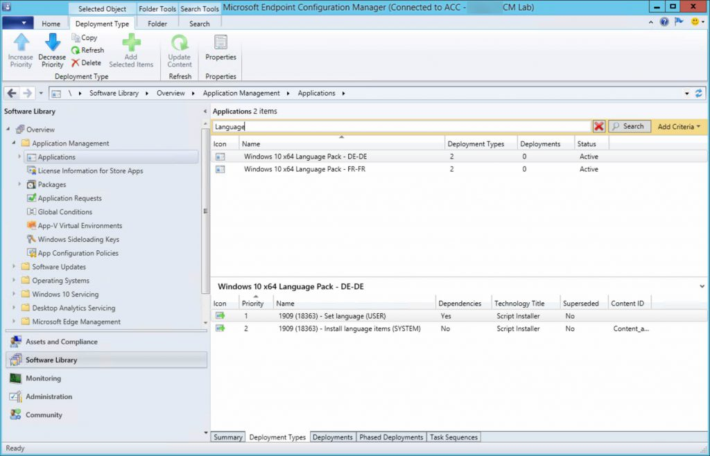
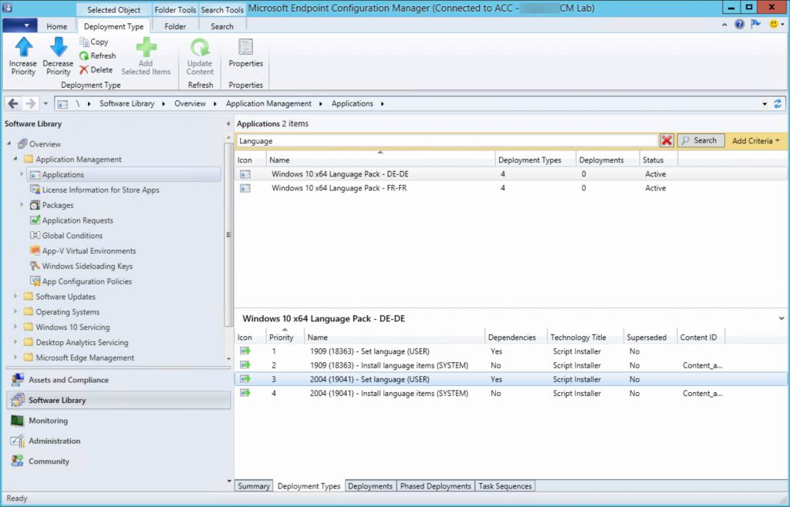

              
This post complements [my other post](https://sysmansquad.com/2020/06/02/language-packs,-language-experience-packs,-language-interface-packs-what?!), where I walk-through the differences of LP, LIP, LXP and FoD.

Here I will show you how to use a PowerShell module I wrote, [PSCMWin10Languages](https://github.com/codaamok/PSCMWin10Language), to create Microsoft Endpoint Manager Configuration Manager Applications for each language you want to deploy via the Software Center.

These Applications are not for OSD. It changes the language only for the user who installs the Application via the Software Center. They will not work for OSD via task sequence.

## Install the module

The module can be found on [GitHub](https://github.com/codaamok/PSCMWin10Language) or the [PowerShell Gallery](https://www.powershellgallery.com/packages/PSCMWin10Language/0.0.1). You can install it like so:

```powershell
Install-Module "PSCMWin10Language" -Scope CurrentUser
```

Check out what functions are given to you:
              
```powershell
Import-Module "PSCMWin10Language"
Get-Command -Module "PSCMWin10Language"
```
              
## Create LP, LXP and FoD repositories

We need to form the source folders for each of our Applications (in other words, for each language we want to support). The source folders will contain the needed LP, LXP and FoD files for each language - a mix of .cab and .appx files.

Using the below functions, we can create the need folders and populate them with the files by extracting them from the ISOs downloaded from VLSC / Visual Studio subscription download portal (MSDN).
              
*New-LPRepository
*New-LXPRepository
*New-FoDLanguageFeaturesRepository

> **Note:** New-FoDLanguageFeaturesRepository only extracts "LanguageFeature" FoDs. If you want to include more FoDs than these, you'll have to arrange something yourself.

If you want to support fewer than a handful of languages, then this process is typically just about OK being completed manually. However, you will have to repeat this for each new version of Windows 10 which will quickly become a drag. Especially if you want to support many more languages. This is what inspired me to write these functions.

Let's assume I want to support languages French and German. Our end goal is to create a folder structure that looks something like this:

```powershell
PS C:\> tree "\\sccm.acc.local\OSD\Source\1909-Languages" | Select-Object -Skip 2
\\SCCM.ACC.LOCAL\OSD\SOURCE\1909-LANGUAGES
+---de-de
¦   +---FoD
¦   +---LP
¦   +---LXP
+---fr-fr
    +---FoD
    +---LP
    +---LXP
```

Start off by going to VLSC or MSDN and downloading the following ISOs for your target Windows 10 version:
              
* Language Pack
* Features on Demand (part 1)

Once downloaded, mount them all and go back to the PowerShell prompt where we imported PSCMWin10Language, and execute the following (replace the appropriate drive letters):

```powershell
New-LPRepository -Language "fr-FR", "de-DE" -SourcePath "I:\x64\langpacks" -TargetPath "\\sccm.acc.local\OSD\Source\1909-Languages"
New-LXPRepository -Language "fr-FR", "de-DE" -SourcePath "I:\LocalExperiencePack\" -TargetPath "\\sccm.acc.local\OSD\Source\1909-Languages"
New-FoDLanguageFeaturesRepository -Language "fr-FR", "de-DE" -SourcePath "J:\" -TargetPath "\\sccm.acc.local\OSD\Source\1909-Languages"
```

## Create the Applications

With the LP, LXP and FoD repositories set up, we're now ready to create our ConfigMgr Application(s)

```powershell
New-CMLanguagePackApplication -SiteServer "cm.contoso.com" -SiteCode "P01" -SourcePath "\\sccm.acc.local\OSD\Source\1909-Languages" -Languages "fr-fr", "de-de" -WindowsVersion @{ "Version" = "1909"; "Build" = "18363" } -GlobalConditionName "Operating System build" -CreateAppIfMissing -CreateGlobalConditionIfMissing
```

There's quite a few parameters used here so let me explain them:

* Site server and site code of your hierarchy, standard stuff
* `-SourcePath` of where we exported all our languages' LP, LXP and FoDs to
* `-Languages` an array of Language tags of which we want to create Applications for. The elements of this array will correlate with the folders directly beneath the given -SouthPath
* `-WindowsVersion` a hashtable which denoates the version and build number of Windows 10 you're deploying language items for. Must contain two keys: "Version" and "Build".
* `-GlobalConditionName` name of the Global Condition which queries the WMI class Win32_OperatingSystem for property Build. If a Global Condition with the given name does not exist, a terminating error is thrown. If it does exist, but it does not query the Win32_OperatingSystem class for the Build property, a terminating error is thrown.
* Lastly, the two switches `-CreateAppIfMissing` and `-CreateGlobalConditionIfMissing` does pretty much it says on the tin; creates those items if they're missing.

This is what the end result looks like:

[](LPSoftwareCenter-EndResult-2-new.jpg)

There are two deployment types: one which runs as user and the other which runs as system. The system deployment type installs LP, LXP and FoD. Whereas the user deployment type registers the LXP, configures the user's language and prompts a reboot is required by returning exit code 3010.

The user deployment type depends on the system deployment type.

Poking around, you'll notice the requirements for all deployment types are that of what you used in the `-WindowsVersion` parameter.

When you're ready to support another OS, or another language, just repeat these instructions with that context in mind and you're good to go!

For example, I used the same process again to create deployment types on the existing Applications for Windows 10 2004:

```powershell
New-LXPRepository -Language "fr-fr", "de-de" -SourcePath "I:\LocalExperiencePack\" -TargetPath "\\sccm.acc.local\OSD\Source\2004-Languages"
New-LPRepository -Language "fr-fr", "de-de" -SourcePath "I:\x64\langpacks\" -TargetPath "\\sccm.acc.local\OSD\Source\2004-Languages"
New-FoDLanguageFeaturesRepository -Language "fr-fr", "de-de" -SourcePath "I:\" -TargetPath "\\sccm.acc.local\OSD\Source\2004-Languages"
New-CMLanguagePackApplication -SiteServer "cm.contoso.com" -SiteCode "P01" -SourcePath "\\sccm.acc.local\OSD\Source\2004-Languages" -Languages "fr-fr", "de-de" -WindowsVersion @{ "Version" = "2004"; "Build" = "19041" } -GlobalConditionName "Operating System build" -CreateAppIfMissing -CreateGlobalConditionIfMissing
```

[](LPSoftwareCenter-EndResult-3-new.jpg)

## Support

If you have any issues with the module, please do open an issue on the [PSCMWin10Language GitHub repository](https://github.com/codaamok/PSCMWin10Language)!
