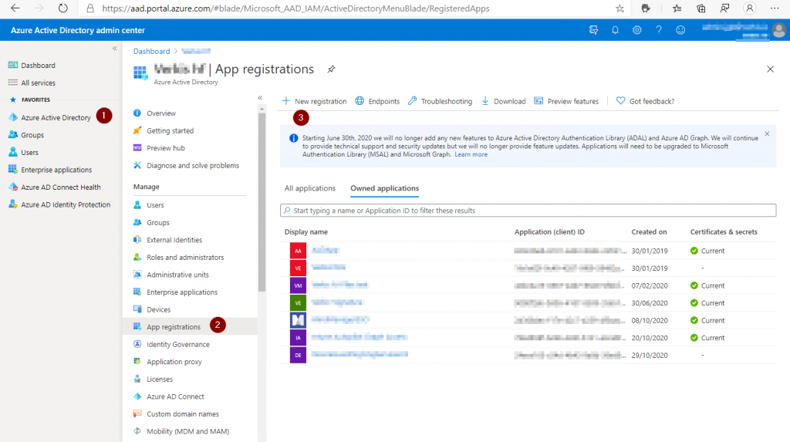
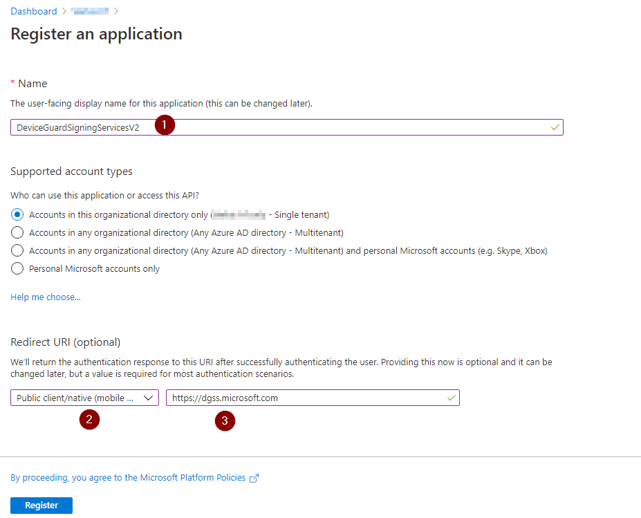
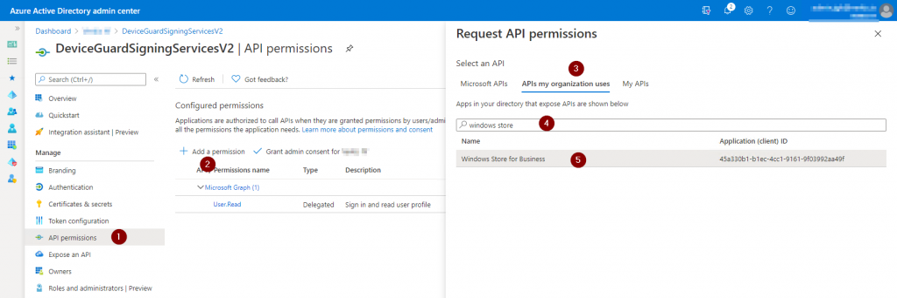
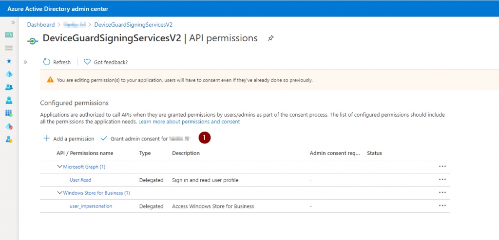
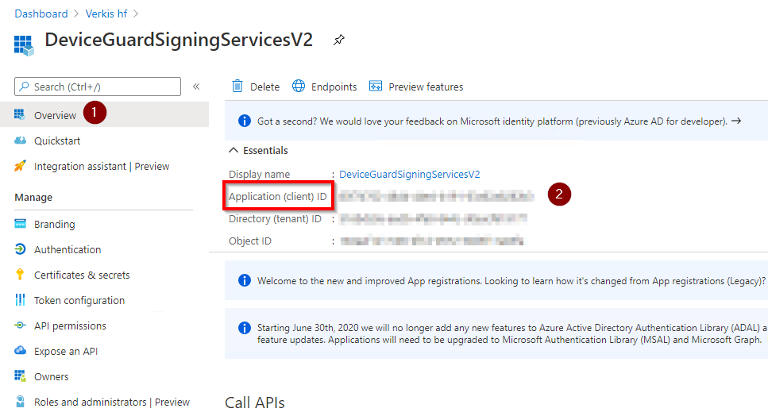

Howdy y'all  
In this post I will show you how to get the Device Guard Signing Service v2 root certificate.

Device Guard Signing Services v1 (DGSS) is being deprecated at the end of December 2020, so we need to migrate to DGSSv2, and it just so happens that the means to download the DGSSv2 root cert is a little bit more complex than the DGSSv1.

## MSIX crash course

While MSIX is generally marketed as a replacement for MSI for developers, there are scenarios that can benefit systems administrators.

  * A means to install an app that has no silent installation
  * Capture installs of apps that require manual setup as part of the post install setup
  * MSIX apps are easy to uninstall, which is not always possible/reliable for some Win32 apps
  * MSIX apps are containerized, you can install multiple versions of the same app at the same time, for example: Office 2010 and M365A/O365 running at the same time
  * MSIX app attach for Windows Virtual Desktops
  * MSIX apps can be installed per user or provisioned for all users on a device

So what does this have to do with certificates?  
The MSIX packaging format has a strict signing requirement. While you can always buy a code signing certificate, you can use a free DGSSv2 certificate from Microsoft.

If you want to know how MSIX apps are setup and deployed, check out [Jake's blog post on MSIX](https://sysmansquad.com/2020/09/15/signing-and-deploying-applications-via-msix-with-intune/).

## Registering the AzureAD app

First we need to setup an AzureAd Application, [this is mostly covered in the official docs](https://docs.microsoft.com/en-us/windows/msix/package/signing-package-device-guard-signing) but it's not very user friendly and when this post was written (31.10.2020), it was missing a crucial step.

For those of you who have done this sort of thing before, here is the quick overview:

  * Sign into AzureAd and start registering an app
  * Under Redirect URI, select "Public client (mobile & desktop)". and set https://dgss.microsoft.com as the URI
  * In the API permissions, select the "Windows Store for Business API", Delegated permissions and select **user_impersonation**
  * Go to the overview and copy the Application (client) ID, and head to the **Get-DGSSv2RootCert** part of this post

For those of you who have never done this before, here are the detailed steps with screenshots.

Sign into Azure AD and register a new application.<figure class="wp-block-image size-large">

 </figure> 

Give it a descriptive name.  
Under Redirect URI, select "Public client (mobile & desktop)", and set https://dgss.microsoft.com as the URI.<figure class="wp-block-image size-large">

 </figure> 

Once the app has been created, click on **API permissions**.  
**Add permissions**.  
Click on **APIs my organization uses**.  
Search for "windows store".  
And click on it.<figure class="wp-block-image size-large">

 </figure> 

Click on **Delegated permissions**.  
And select **user_impresonation**.<figure class="wp-block-image size-large">

 </figure> 

Click on **Grant consent for...** otherwise the app will not work.<figure class="wp-block-image size-large">

 </figure> 

Now head back to the application overview and copy the GUID that's next to **Application (client) ID**, this is used in a script that is featured in this blog post.<figure class="wp-block-image size-large">

 </figure> 

## Get-DGSSv2RootCert

Since for most people, downloading the root certificate is a one time operation, I elected to run this this in a [windows sandbox](https://docs.microsoft.com/en-us/windows/security/threat-protection/windows-sandbox/windows-sandbox-overview). but that is 100% optional.

Paste the application GUID into the $AppID variable and you should be ready to go.

  <pre class="CodeMirror" data-setting="{"mode":"powershell","mime":"application/x-powershell","theme":"default","lineNumbers":true,"styleActiveLine":true,"lineWrapping":true,"readOnly":false,"fileName":"Get-DGSSv2RootCert.ps1","language":"PowerShell","modeName":"powershell"}"># This simple script is used to download the Device Guard Signing Service v2 Root Certificate

# please add your own App ID
$AppID = "PUT YOUR GUID HERE"

# we need to add nuget as a package source first
Register-PackageSource -Name MyNuGet -Location https://www.nuget.org/api/v2 -ProviderName NuGet -Confirm:$false -Force

# installing the package
Install-Package Microsoft.Acs.Dgss.Client -Source mynuget -Confirm:$false -Force -Verbose

# importing the module
Import-Module "C:\Program Files\PackageManagement\NuGet\Packages\Microsoft.Acs.Dgss.Client.1.0.11\PowerShell\Microsoft.Acs.Dgss.Client.dll"

# just for convenience
New-Item -Path c:\ -Name "DGCertv2" -ItemType Directory -Force

# downloading the cert to the folder specified above, this step is not instant, ive seen it take a while
Get-RootCertificate -PassThru -OutFile C:\DGCertv2\DGSSv2root.cer -AppId $AppID

# voila! the cert appears before your eyes
start C:\DGCertv2\</pre>

Congrats, you now have a Device Guard Signing Service v2 Root Certificate in your possession.

Now you can deploy the cert to your clients using your delivery mechanism of choice.
