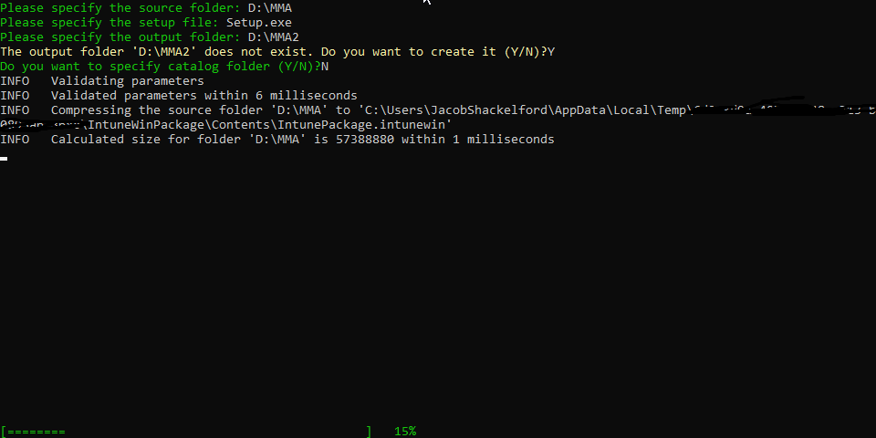

## Why do I need logs?

The purpose of this guide is to configure the collection of Logs in an Intune environment. By default the log analytics you enable in Intune does not give you much information beyond auditing basic things. With this approach we can record any desired log for all of our machines. There is a companion video for this setup [https://youtu.be/Uw3GjMnSXbI](https://youtu.be/Uw3GjMnSXbI).

## Enabling Log Analytics

  1. Navigate to [endpoint.microsoft.com](https://endpoint.microsoft.com/#home)
  2. Select **Reports**
  3. Select **Diagnostic Settings**
  4. Select **Add Diagnostic setting**
  5. Select all options under **Log**
  6. Select **Send to Log Analytics workspace**
  7. Select a Log Analytics workspace
      1. You can archive to a storage account to keep data longer

Now that we have the log analytics workspace configured we can configure the Microsoft Monitoring Agent (MMA)

## Configuring the Microsoft Monitoring Agent 

  1. Navigate to [portal.azure.com](https://portal.azure.com/)
  2. Navigate to your log analytics workspace
  3. Select **Advanced Settings**
  4. Select **Data**  
    You can now add any event log you wish to collect. Begin typing a log you wish to collect and it should auto populate. If the log you wish to use does not appear you can type in the full log path and it will be added. I've included an example of a few logs below, please bare in mind that if the log is not enabled by default you will still need to enable that log separately. 

  

  1. Navigate back to your log analytics workspace
  2. Select **Agents management**
  3. Copy down the **Workspace ID** and **Primary Key**
  4. Select **Download Windows Agent (64bit)** 
  5. Create a folder and put the **MMA-Setup-AMD64.exe** inside of it
  6. Open command prompt and run **MMA-Setup-AMD64.exe /C** in the directory your install exists
  7. Extract the contents to your desired folder
  8. Download the repo located [Github-IntuneContentPrep][2]
  9. Extract and run the **IntuneWinAppUtil.exe**
 10. Specify the **source folder**
 11. Specify the **setup file** (Setup.exe)
 12. Specify an **output folder**

## Creating the MMA app deployment

  1. Navigate to [endpoint.microsoft.com](https://endpoint.microsoft.com/#home)
  2. Select **Apps**
  3. Select **Windows**
  4. Select **Add**
  5. Select **Windows app (Win32)**
  6. Select the app package from the output folder you created in the previous steps
  7. Change the following
      1. Name : Microsoft Monitoring Agent
      2. Publisher: Microsoft
      3. Logo: Add any logo you'd like
  8. Select **Next**
  9. Set the install command to: `setup.exe /qn NOAPM=0 ADD_OPINSIGHTS_WORKSPACE=1 OPINSIGHTS_WORKSPACE_AZURE_CLOUD_TYPE=0 OPINSIGHTS_WORKSPACE_ID="WORKSPACEID" OPINSIGHTS_WORKSPACE_KEY="KEYSAVED" AcceptEndUserLicenseAgreement=1"`
 10. Change the **WorkspaceID** and **WorkspaceKey** to the ones you recorded earlier
 11. Paste the same for the uninstall command
 12. Select **Next**
 13. Add your Requirements
 14. Select **Next**
 15. Manually configure a detection rule
 16. Select **Add**
 17. Select **Registry** 
 18. Key path: `Computer\HKEY_LOCAL_MACHINE\SYSTEM\CurrentControlSet\Services\HealthService\Parameters\Management Groups\AOI-#YOURWORKSPACEID`
 19. Change the **#YourWorkspaceID** section to what you recorded earlier
 20. Select **Ok**
 21. Select **Next**
 22. Select **Next**
 23. Add **Assignments** 
 24. Select **Next**
 25. Select **Create**

## Checking the logs

Once the clients receive the agent you should be able to check for a heartbeat immediately in log analytics. I'll show two quick queries we can run as an example.

  1. Navigate to [portal.azure.com](https://portal.azure.com/)
  2. Navigate to your log analytics workspace
  3. Select Logs
  4. In the query section type the following and select **Run**: 

`Event | where TimeGenerated > ago(24h) | limit 10`

This will bring up the last 10 log events that were registered in log analytics, we limit to 10 for testing purposes. Next we will look at querying a specific log and showing a specific set of columns we are interested in.

`Event`  
`| where EventLog == "System"`  
`| project TimeGenerated, EventLog, EventLevelName, EventID, RenderedDescription, Computer`

At this point you have everything configured and are only limited to your querying knowledge!

 [2]: https://github.com/Microsoft/Microsoft-Win32-Content-Prep-Tool
