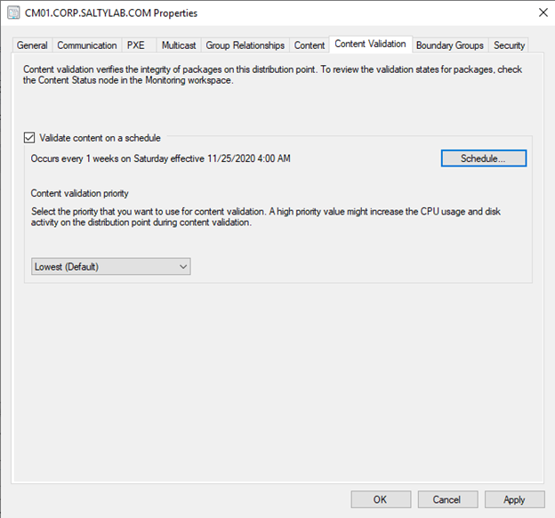
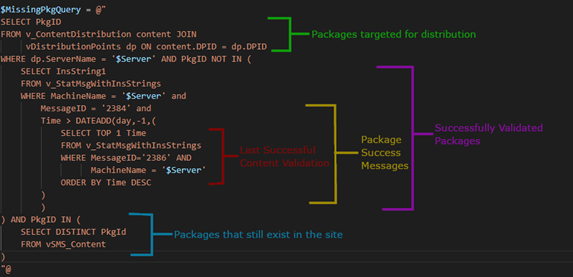
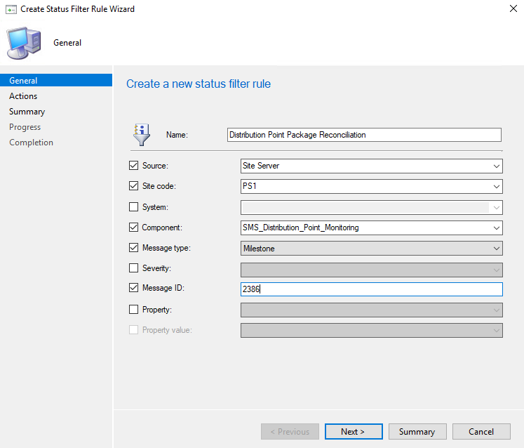
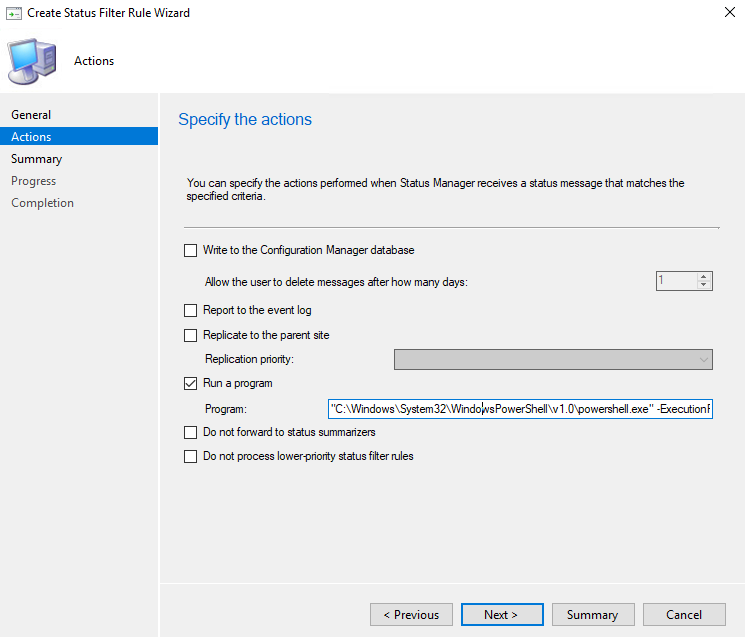

Distribution Points are great, but they can often be a huge annoyance. Getting content distributed is one thing, but then making sure it STAYS distributed, and old things are getting cleaned up, and making sure all the content hashes are correct, etc. It’s easy to feel like you’re constantly drowning in a sea of DP warnings and errors.

Luckily, there’s some simple things we can do to take this burden away. I’m really only going to go into detail on the Content Library Reconciliation bit, as that’s the one which has caused me a lot of headache in the past, but I’ll drop some links and some high level detail for other things to consider.
 

  

    

      Table Of Contents
    

  

  
  

    <ol class="uagb-toc__list">
      <li class="uagb-toc__list">
        [Pull DPs vs Standard DPs](#pull-dps-vs-standard-dps)<li class="uagb-toc__list">
          [Windows Server Deduplication](#windows-server-deduplication)<li class="uagb-toc__list">
            [Content Validation](#content-validation)<li class="uagb-toc__list">
              [Content Library Cleanup](#content-library-cleanup)<li class="uagb-toc__list">
                [Content Library Reconciliation](#content-library-reconciliation)<li class="uagb-toc__list">
                  [Mismatches Between Filesystem & WMI](#mismatches-between-filesystem-wmi)<li class="uagb-toc__list">
                    [Putting It All Together](#putting-it-all-together)</ol> 
 
 
 
## Pull DPs vs Standard DPs
                    
                    
                    

                      I’m not going to reinvent the wheel on going over the differences between standard DPs and pull DPs. Suffice it to say that there are significant benefits to considering pull DPs, particularly if you’re working in a larger environment. For a good write up on this, see Bryan Dam’s blog:
                    

                    
                    

                      [https://damgoodadmin.com/2019/10/04/pull-distribution-points-great-dps-or-greatest-dps/](https://damgoodadmin.com/2019/10/04/pull-distribution-points-great-dps-or-greatest-dps/)
                    

                    
                    

                      For our purposes here, the difference doesn’t matter much. It’s more down to processing overhead and transfer rates. But both standard and pull DPs present the same challenges when it comes to content management.
                    

                    
                    
## Windows Server Deduplication
                    
                    
                    

                      This one is a bit more important, as it does directly affect content on the DP. Bryan Dam has a good summary of the benefits of enabling dedupe in that same post linked above. It not only saves disk space in general, but also preps you for BranchCache by ensuring all the content hashes BranchCache needs are already calculated up front (rather than needing to calculate them on the fly), saving more disk space and processing overhead.
                    

                    
                    
## Content Validation
                    
                    
                    

                      Content Validation is incredibly useful. You can set it to run on a schedule in the Properties pane of the DP. You can also run it manually by just running smsdpmon.exe (in the **SMS_DP$\sms\bin** folder on every DP), or you can validate a single package either from the Content tab of a DP in the console, or via command line.
                    
<figure class="wp-block-image size-large">
                    
                    </figure> 

                      Peter van der Woude has a good quick start overview of using smsdpmon:
                    

                    
                    

                      [https://www.petervanderwoude.nl/post/what-is-smsdpmon-exe/](https://www.petervanderwoude.nl/post/what-is-smsdpmon-exe/)
                    

                    
                    

                      The basic workflow for this process looks something like this:
                    

                    
                    <ol type="1">
                      <li>
                        The package list is loaded from the distribution point
                      </li>
                      <li>
                        For every package in the list, content item hashes are validated against what’s in the content library on the site server
                      </li>
                      <li>
                        If anything fails the validation, a status message is kicked back to the site, which will flip the package into a “Failed” distribution state
                      </li>
                    </ol>
                    
                    

                      Pretty simple, right? But be very aware of step 1: the package list that smsdpmon is checking is what is *currently on the distribution point*, not necessarily what *should* be there. If there is content you’ve sent to the distribution point, but it never arrived or maybe was removed for whatever reason, the content validation process is oblivious to that content.
                    

                    
                    

                      The best part of Content Validation is that it kicks back status messages for everything (validation cycle started, package validation success/failure, validation cycle completed, validation cycle failed, etc.). This makes it really easy to use as a trigger for automation, which I’ll show in a bit. But first, we need to look at . . .
                    

                    
                    
## Content Library Cleanup
                    
                    
                    

                      The Content Library Cleanup Tool does just that: It cleans up the content library on a distribution point of any content which is not associated with any packages. You’ll find it in **CD.Latest\SMSSETUP\TOOLS\ContentLibraryCleanup** on your site server. It’s pretty well documented:
                    

                    
                    

                      [https://docs.microsoft.com/en-us/mem/configmgr/core/plan-design/hierarchy/content-library-cleanup-tool](https://docs.microsoft.com/en-us/mem/configmgr/core/plan-design/hierarchy/content-library-cleanup-tool)
                    

                    
                    

                      It’s pretty straightforward, and useful for keeping your distribution point content library spick and span. It’s also easy to set as a scheduled task to run regularly, with **/delete /q**. However, there are some considerations here:
                    

                    
                    

                      This is a destructive process, and there’s room for error. There are warnings in the doc, and when you run the tool, to verify what is being deleted before you confirm it for deletion. A simple example would be if an admin deleted a package from a distribution accidentally (even if that DP is still a member of a DP group the package is targeted at), the content library cleanup tool will delete that package. So unless you’re pairing this with some automation to reconcile packages which shouldn’t have been deleted, make sure you’re validating the results carefully.
                    

                    
                    

                      If you’re automating this, consider running it locally on your DPs, rather than remotely. This is especially useful if you have a lot of DPs, or if you have DPs across slow links. The process takes awhile, and most of the scanning it does happens against the DP (the only other call it makes is out to the SMS Provider to get currently targeted packages). It will go much more quickly if it’s running from the DP itself.
                    

                    
                    

                      If you *do* run this from the DP, note that it will need to be with a service account which has Full Admin rights within ConfigMgr. So take that into consideration when deciding how to automate this.
                    

                    
                    
## Content Library Reconciliation
                    
                    
                    

                      This is where we need to do some custom scripting. If you just want the script, you can get it on my github here:
                    

                    
                    

                      [https://github.com/SaltyPeaches/CM_DPManagement/blob/main/PackageReconciliation.ps1](https://github.com/SaltyPeaches/CM_DPManagement/blob/main/PackageReconciliation.ps1)
                    

                    
                    

                      If you’re more curious, keep reading. 😊
                    

                    
                    

                      Remember what I mentioned about the Content Library Cleanup Tool being destructive? This can have the effect that content items which ought to exist on your DP are removed. This can also occur, of course, simply if someone manually removes content from a DP.
                    

                    
                    

                      The problem then is:
                    

                    
                    <ol type="1">
                      <li>
                        Removed items may still be targeted at the DP (or DP group), meaning content which ought to be there is no longer there. The site server still assumes the content is there as it should be.
                      </li>
                      <li>
                        Remember what I said about Content Validation only looking at the existing content items on the DP? This means that manually removed items (whether by an admin or by the Content Library Cleanup Tool) will NOT be caught by Content Validation. In fact, Content Validation won’t know anything about those items.
                      </li>
                    </ol>
                    
                    

                      This can result in odd and sometimes difficult to diagnose behavior. You may see clients failing OSD, because they couldn’t download a specific content item at some particular step of the task sequence. Ordinarily you would expect those clients to never begin the task sequence, but in this case the content will actually pass the “Resolving task sequence content” phase (because the Site Server still thinks the content is there), and simply fail with a 404 when a download is actually attempted.
                    

                    
                    

                      The solution to this, luckily, is quite simple. We can actually piggyback off Content Validation here to do a package reconciliation. The idea is simple:
                    

                    
                    <ul>
                      <li>
                        Regular content validation is ensuring and reporting back to the site server all the valid content which exists on the DP
                      </li>
                      <li>
                        We can use those status messages from the content validation cycles to determine what is missing which should be there, and redistribute those missing things
                      </li>
                    </ul>
                    
                    

                      There are two status message IDs we need to care about for our script:
                    
<figure class="wp-block-table">
                    
                    <table class="has-subtle-light-gray-background-color has-background">
                      <tr>
                        <th>
                          MessageID
                        </th>
                        
                        <th>
                          Description
                        </th>
                      </tr>
                      
                      <tr>
                        <td>
                          2386
                        </td>
                        
                        <td>
                          Content Validation completed successfully
                        </td>
                      </tr>
                      
                      <tr>
                        <td>
                          2384
                        </td>
                        
                        <td>
                          Package content passed content validation
                        </td>
                      </tr>
                    </table></figure> 
                    
                    

                      Using those MessageIDs, we can:
                    

                    
                    <ol type="1">
                      <li>
                        Determine when the last content validation cycle completed
                      </li>
                      <li>
                        Determine which packages were successfully validated in that cycle.
                      </li>
                      <li>
                        Determine what packages are missing by cross-checking against what is targeted for distribution at the distribution point
                      </li>
                      <li>
                        Redistribute those things
                      </li>
                    </ol>
                    
                    

                      So, let’s break the script up into those sections. Most of the heavy lifting here happens in SQL.
                    
<figure class="wp-block-image size-large">
                    
                    </figure> 

                      But wait, what's this bit?
                    
<figure class="wp-block-image size-large">
                    
                    </figure> 

                      That’s because we’re relying on v_ContentDistribution to determine what’s targeted at the distribution point. That view is really just all the status messages received for content distribution. Those status messages don’t get purged when a package is deleted from the site. So we need to do a quick filter on all the packages that still exist to account for that.
                    

                    
                    

                      Once you have all that, the redistribution is actually quite simple. There’s a property in an instance of the SMS_DistributionPoint class called “RefreshNow”. Simply by setting that to “$true” and doing a put() to write that instance back to WMI, the site server will begin redistributing that package to that distribution point.
                    
<figure class="wp-block-image size-large">
                    
                    </figure> 

                      So, we know what packages are missing when they should be there, and we have a script to redistribute them. Great! Now let’s fully automate it with a Status Filter Rule!
                    

                    
                    

                      Luckily, we already know the MessageID we need. We’ll just trigger a reconciliation check/remediation any time content validation succeeds.
                    

                    
                    

                      Drop the script somewhere on your site server. I’m putting mine in E:\Scripts. Then just create your status filter rule to trigger off MessageID 2386 from the SMS_Distribution_Point_Monitoring component.
                    

                    
                    

                      Your action is going to be calling the PowerShell script and passing the parameters. The good news? Status Filter Rules can pass data of the status message directly to our script! Which means we can just use %msgsys to pass the server name that just completed a Content Validation Cycle.
                    

                    
                    

                      Your action command will look something like this:
                    

                    
                    `“C:\Windows\System32\WindowsPowerShell\v1.0\powershell.exe” -ExecutionPolicy Bypass -File “E:\Scripts\PackageReconciliation.ps1” -Server %msgsys -SiteCode PS1 -DBServer CMDB.contoso.com -DB CM_PS1`<figure class="wp-block-image size-large">
                    
                    <figcaption>For some reason, the SMS_Distribution_Point_Monitoring component isn't selectable from the dropdown. So you will need to key it in manually,</figcaption></figure> <figure class="wp-block-image size-large"></figure> 

                      There's one caveat to this that if you have empty packages targeted for distribution, those will not get touched by Content Validation (since there's nothing to validate). My script isn't accounting for that, so if you have any of those, you're going to see those empty packages "redistributed" to a DP every time a content validation cycle completes. The simple fix for that is "Don't distribute empty things". 😊
                    

                    
                    
## Mismatches Between Filesystem & WMI
                    
                    
                    

                    
                    
                      *I started writing this before ConfigMgr 2010 was released, and this very thing was addressed in that release. If you are already on 2010 or later, simply make sure you're using the latest version of the Content Library Cleanup Tool, and this issue should be taken care of without the need for a script. [See here for details.](https://docs.microsoft.com/en-us/mem/configmgr/core/plan-design/changes/whats-new-in-version-2010#improvements-to-the-content-library-cleanup-tool)*
                    
                    
                    

                    
                    

                      It can happen where you end up with mismatches between the package list in WMI on a distribution point and the package INI files which are in the distribution point content library (e.g., if you're removing content when a DP is offline). This will leave you in a state where our above script will never run, because content validation never completes successfully. So it’s best to address this one as well, to nip it in the bud and keep everything churning along nicely.
                    

                    
                    

                      This has already been covered pretty extensively in blogs and forum posts, so I’ll just point you to a good one:
                    

                    
                    

                      [https://www.lieben.nu/liebensraum/2014/09/content-validation-issues-in-sccm-2012/](https://www.lieben.nu/liebensraum/2014/09/content-validation-issues-in-sccm-2012/)
                    

                    
                    

                      He provides a script which can be run remotely from the site server to remediate this. It’s pretty easy to turn that into another status filter rule. I’ve taken his code, added some logging and a section to kick off another Content Validation cycle, and put it in my github. You can get it here:
                    

                    
                    

                      [https://github.com/SaltyPeaches/CM_DPManagement/blob/main/PackageMismatches.ps1](https://github.com/SaltyPeaches/CM_DPManagement/blob/main/PackageMismatches.ps1)
                    

                    
                    

                      The event ID you’ll want to trigger on is 2388. Just as before, we can use %msgsys to pass the system name as a parameter value to our script.
                    

                    
                    `“C:\Windows\System32\WindowsPowerShell\v1.0\powershell.exe” -ExecutionPolicy Bypass -File “E:\Scripts\PackageReconciliation.ps1” -Server %msgsys`<figure class="wp-block-image size-large">
                    
                    </figure> <figure class="wp-block-image size-large"></figure> 
## Putting It All Together
                    
                    
                    

                      Once you have the two scripts in place to be triggered by Status Filter rules, the rest really just comes down to scheduling. In terms of order of operations here, you’re going to want to do the content library cleanup before content validation (i.e., clean things up, validate what’s left, then reconcile). Generally what I do is set is content library cleanup to run as a scheduled task late on Friday nights (local to the timezone of the DP), then Content Validation to run the following morning. That way you end up with an entire weekend for any package reconciliation to happen before people start coming back into the office. But your mileage may vary, and every environment is different. So work out a schedule that fits your needs. 😊
                    

