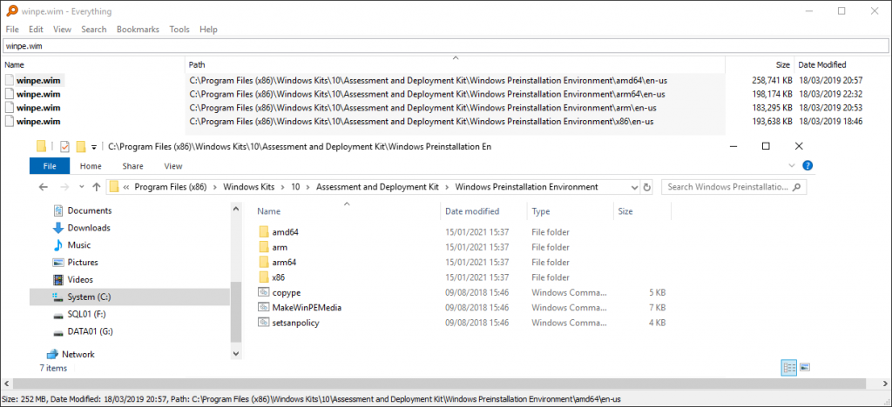
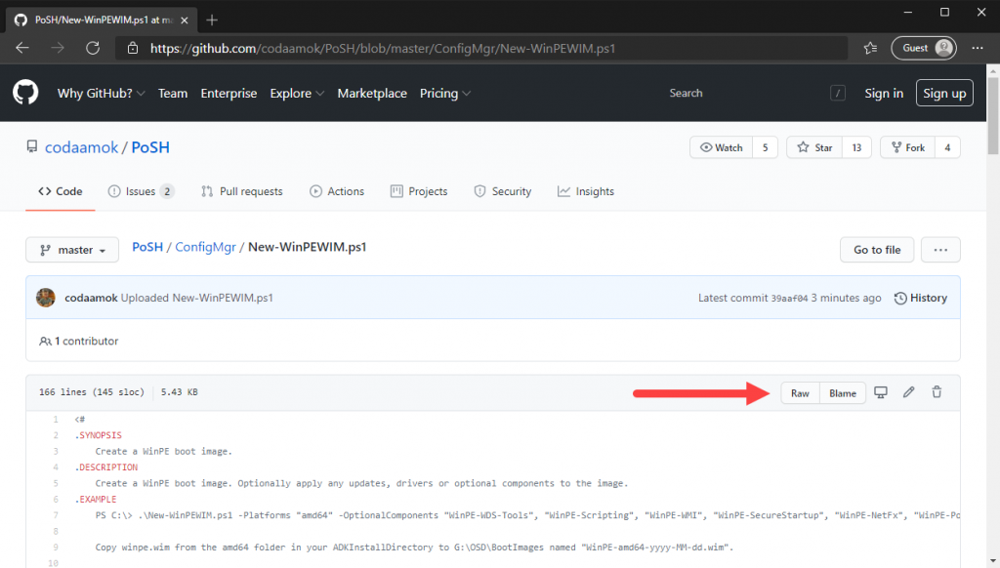

            
## Introduction

In this post I'll show you how you can create a new boot image in ConfigMgr.

There's plenty of good content out there already on this, but I was interested to write this because I didn't see many PowerShell examples out there until I came across Michael Niehaus' post on [Build your own Windows PE image](https://oofhours.com/2021/01/17/build-your-own-windows-pe-image/). A fantastic post, highly recommend reading it. Michael provided a useful script at the end of this post in a .zip file. I felt it could do with some improvements.

In this post I'll share two ways on how to create a boot image for ConfigMgr:

* The "GUI" way: copy the WinPE.wim file from your ADK directory, importing it into ConfigMgr, and adding your optional components drivers via the console
* Using PowerShell to copy the WinPE.wim, add our drivers and optional components and then import into wherever you need

Generally, it's better to not modify the default boot images that come out of the box with ConfigMgr. But if you've modified them, don't sweat it, at least you'll have this post to help you create a fresh one in future if need.

## The "GUI" way

1. Navigate to your ADK installation directory. It'll likely be `C:\Program Files (x86)\Windows Kits\10\Assessment and Deployment Kit\Windows Preinstallation Environment`
1. You'll notice you have multiple winpe.wim files on disk, one for each architecture:  

1. Let's run with the most common requirement here and copy `amd64\en-us\winpe.wim` to any destination directory you need
1. Optionally rename it to something more particular, perhaps to include today's date and architecture e.g. `WinPE-amd64-2021-02-13.wim`
1. Open the ConfigMgr console, and right click on Boot Images under Software Library > Operating Systems.  
[](createnewbootimageconfigmgr-2.png)Add Boot Image in ConfigMgr console  
1. Go through the wizard to browse out and select our new boot image `WinPE-amd64-2021-02-13.wim`
1. After the wizard completes, you'll notice that ConfigMgr duplicated the .wim file and appended the PackageID to the file name. Any changes we make to this boot image, e.g. add optional components or drivers, ConfigMgr will modify the .wim file with the PackageID in the filename, leaving the original untouched.  

For each change you make to this boot image, ConfigMgr will always start with a fresh copy from the original - the one without the PackageID in the file name. **Don't delete it**! Otherwise you'll find yourself making a new one, again, when you come to update drivers or add new components later.

[](createnewbootimageconfigmgr-3.png)Boot image on disk and in console after imported

Now you're free to do as you please with your new fresh new vanilla boot image. You'll notice adding optional components etc will increase the file size, naturally.

[](createnewbootimageconfigmgr-4.png)Boot image with drivers and optional components addedWhat I want to point out here is that because we did these actions within the ConfigMgr console, i.e. add drivers and optional components, we can see exactly what those drivers and components are.

When we come to do this using PowerShell, our new boot image will contain all the same drivers and optional components, however when we right click and go to Properties like I demonstrated in the screenshots above, you won't actually see anything in the **Drivers** or **Optional Components** tabs.

## Using PowerShell

This was inspired by Michael Niehaus's script but I added some improvements.

* [Download New-WinPEWIM.ps1](https://github.com/codaamok/PoSH/blob/master/ConfigMgr/New-WinPEWIM.ps1) from my GitHub by cloning my repo or clicking the Raw button, right clicking empty space and selecting "Save As". It will attempt to download it as .txt. Just rename it to .ps1 as the only file extension.

[](createnewbootimageconfigmgr-5.png)View New-WinPEWIM.ps1 as Raw

* Execute the script. Customise any of the parameters to suit your needs: 
            
```powershell
.\New-WinPEWIM.ps1 -Platforms amd64 -OptionalComponents "WinPE-WDS-Tools", "WinPE-Scripting", "WinPE-WMI", "WinPE-SecureStartup", "WinPE-NetFx", "WinPE-PowerShell", "WinPE-StorageWMI", "WinPE-DismCmdlets" -OutputDirectory "G:\OSD\BootImages" -DriversDirectory "G:\Drivers\WINPE10.0-DRIVERS-A22-3GVJN\x64"
```

YouTube video on using New-WinPEWIM.ps1

You'll notice that when you import this to ConfigMgr, the **Drivers** and **Optional Components** tabs will be blank. Since ConfigMgr wasn't the tool used to inject drivers or optional components, it doesn't know what it doesn't know!

This is arguably a reasonable drawback of using this approach, because it creates a little obfuscation. Another admin who was looking through your boot images wouldn't understand there are already drivers and optional components added to the boot image. Their only clue when looking at it on face value would be that the file size would be larger than the default.

### Update

Adam Gross has a script on his GitHub where you can import a new WinPE boot image to your ConfigMgr site while still being able to get those juicy tabs / metadata fields populated!

[New-BootImage.ps1](https://github.com/AdamGrossTX/PowershellScripts/blob/master/ConfigMgr/BootImage/New-BootImage.ps1)

It looks like it doesn't have a parameter to let you specify which Optional Components you want injected, it's hardcoded on [line #214](https://github.com/AdamGrossTX/PowershellScripts/blob/master/ConfigMgr/BootImage/New-BootImage.ps1#L214). So tinker with that if you want to add different, more, or fewer optional components.

It also doesn't have a parameter for it to inject a directory of drivers. I'll make a PR at some point and update this block when that's done.

None the less I hope you found this useful. Let me know if you have any questions or feedback in the comments below, or [DM/tweet me on Twitter @codaamok](https://twitter.com/codaamok).
