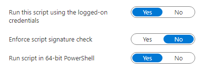

 

As you may have noticed by now, there doesn't seem to be any nice built in way to set environmental variables in intune 🙁

## The Problem

Setting a user environmental variable using powershell is an easy task to accomplish, you basically just run the following:

  <pre class="CodeMirror" data-setting="{"mode":"powershell","mime":"application/x-powershell","theme":"default","lineNumbers":true,"styleActiveLine":true,"lineWrapping":true,"readOnly":false,"fileName":"example.ps1","language":"PowerShell","modeName":"powershell"}">Set-ItemProperty -Path HKCU:\Environment -Name temp -Value "c:\temp\"</pre>

This works just fine, but won't take effect until the user either reboots or signs into the device again. Which is obviously not ideal.

I spent a little time looking into this and i found out that when you change the environmental variable manually via the GUI, a [WM_SETTINGCHANGE message](https://docs.microsoft.com/en-us/windows/win32/winmsg/wm-settingchange) is broadcast to the system and that refreshes them, but how you do that with powershell?

## The Solution

As it turned out, my fellow sysmansquad member [Grant Dickins](https://sysmansquad.com/author/gduk/) had a solution to the problem.

  <pre class="CodeMirror" data-setting="{"mode":"powershell","mime":"application/x-powershell","theme":"default","lineNumbers":true,"styleActiveLine":true,"lineWrapping":true,"readOnly":false,"fileName":"Example 2.ps1","language":"PowerShell","modeName":"powershell"}">[System.Environment]::SetEnvironmentVariable('TEMP','c:\temp\','User')</pre>

Which both sets the variable and broadcasts the change to the rest of the system!

## Putting it all together

Intune has a very nice feature called Proactive Remediation that is part of endpoint analytics. and its the perfect tool for the job!

If you are new to using Proactive Remediations, check out Jake Shackelford's [blog post,](https://sysmansquad.com/2020/07/07/intune-autopilot-proactive-remediation/) it will get you up to speed in no time.

When you create the Proactive remediation, you need to configure it to run as the logged-on user.<figure class="wp-block-image size-large">

 </figure> 

## The Script

First up is the Detection script, pretty simple stuff, it checks if the temp and tmp variables are set to the path i want.

Note that if you want to use a different path, just change line 5 in both scripts.

  <pre class="CodeMirror" data-setting="{"mode":"powershell","mime":"application/x-powershell","theme":"default","lineNumbers":true,"styleActiveLine":true,"lineWrapping":true,"readOnly":false,"fileName":"Detection.ps1","language":"PowerShell","modeName":"powershell"}"># Discovery

# path to the directory that TEMP and TMP should point towards
# Make sure its the same in both the remediation and discovery scripts
$value = "c:\temp\"

try {

    # create the temp directory if it doesn't exist, no need to use a remediation to do that
    if ( (Test-Path -Path $value -ErrorAction stop) -eq $false ) {
        Write-Host "$value directory missing"
        exit 1
    }

    # check the TEMP environmental variable
    $TempVar = [System.Environment]::GetEnvironmentVariable('TEMP', 'User')
    if ($TempVar -ne $value) {
        Write-Host "failure, Temp is set to $TempVar"
        exit 1
    }

    # check the TMP environmental variable
    $TmpVar = [System.Environment]::GetEnvironmentVariable('TMP', 'User')
    if ($TmpVar -ne $value) {
        Write-Host "failure, Tmp is set to $TmpVar"
        exit 1
    }

    Write-Host "Temp/tmp Variables set correctly"
    exit 0

}
catch {
    $errMsg = $_.Exception.Message
    Write-Host $errMsg
    exit 1 
}</pre>

The remediation is not much to write home about. It sets the variables and runs the code needed to refresh the system.

  <pre class="CodeMirror" data-setting="{"mode":"powershell","mime":"application/x-powershell","theme":"default","lineNumbers":true,"styleActiveLine":true,"lineWrapping":true,"readOnly":false,"fileName":"Remediation.ps1","language":"PowerShell","modeName":"powershell"}"># Remediation

# path to the directory that TEMP and TMP should point towards
# Make sure its the same in both the remediation and discovery scripts
$value = "c:\temp\"

try {

    # create the temp directory if it doesn't exist
    if ( (Test-Path -Path $value) -eq $false ) {
        New-Item -Path $value -ItemType Directory
    }

    # set the variables
    [System.Environment]::SetEnvironmentVariable('TEMP', "$value", 'User')
    [System.Environment]::SetEnvironmentVariable('TMP', "$value", 'User')

    Write-Host "User variables Changed"
    exit 0
}
catch {
    $errMsg = $_.Exception.Message
    Write-Host $errMsg
    exit 1 
}</pre>

## Outro

So there you go, a simple proactive remediation that you can use to change user environmental variables with relative ease. You can trivially adopt this to change any other variable. Either user or System variable.
