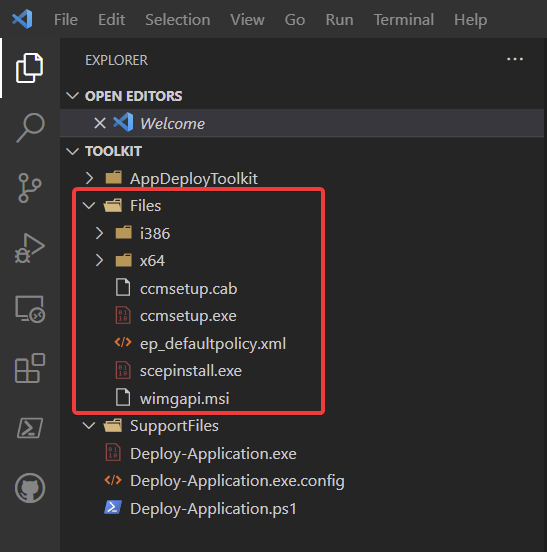
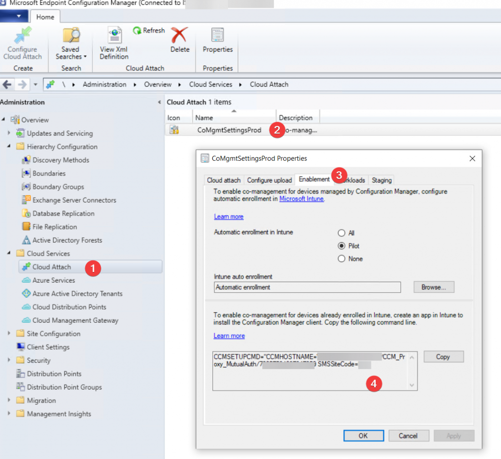
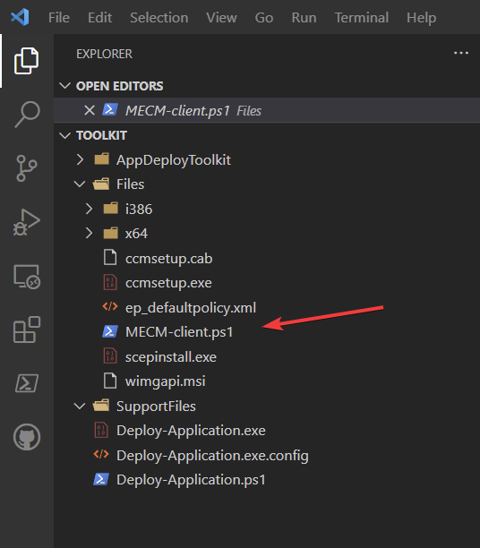

## Hey siri, write a blog post for me.

Deploying the Configuration manager client is usually pretty simple. the procedure is [well documented](https://docs.microsoft.com/en-us/mem/configmgr/core/clients/deploy/plan/client-installation-methods).

However there are issues if you plan on installing the CM client during Autopilot using the officially suggested methods

Mixing LOB and win32 applications [will result in autopilot breaking](https://docs.microsoft.com/en-us/mem/intune/apps/lob-apps-windows), so you should use win32 apps exclusively, which somewhat contradicts the official way of installing the CM client with intune.

  
Installing the Configuration manager client during the middle of autopilot will break autopilot, as the Configuration manager client essentially becomes the management authority the moment it becomes active, causing intune to have no idea how to proceeed.  
  
Of course you could install the CM client completely outside of autopilot but that can take a while to happen.

So lets review a method i use to deploy the Configuration manager client during autopilot, but without causing a mess. 

## How i do it

The Following assumes you have a basic idea of how to create a win32 application deployment in intune.


## Lets build Script!

Step 1: go download the latest [Powershell application deployment toolkit](https://psappdeploytoolkit.com/)

Step 2: Add the client install files from \\SiteServer\SMS_ABC\Client to the Files directory in your Powershell Application Deployment Toolkit, you should end up with a directory that looks similar to this:<figure class="wp-block-image size-large">

 <figcaption>oh wow!</figcaption></figure> 

Step 3: open Deploy-Application.ps1 in your favorite powershell editor.

  
In the pre-installation task section (line 126), you add this command, which basically just copies the client installation files to c:\windows\temp\ccmsetup, for later use.


```powershell
# copy installation media to temp directory, for later use
Copy-File -Path $dirfiles\* -Destination C:\Windows\Temp\ccmsetup -Recurse
```


Next up, add this to the installation task section (line 140).  
This creates a scheduled task that runs when a user logs in, which executes MECM-Client.ps1, more on that script later.


```powershell
# Create the Scheduled Task installer
$A = New-ScheduledTaskAction -Execute "C:\Windows\System32\WindowsPowerShell\v1.0\powershell.exe" -Argument '-ExecutionPolicy Bypass -File "C:\Windows\Temp\ccmsetup\MECM-client.ps1"'
$T = New-ScheduledTaskTrigger -Once -At (Get-Date) # thanks @alpharius
[Array]$T += New-ScheduledTaskTrigger -AtLogOn
$P = New-ScheduledTaskPrincipal "NT Authority\System"
$S = New-ScheduledTaskSettingsSet -AllowStartIfOnBatteries -DontStopIfGoingOnBatteries -StartWhenAvailable
$task = New-ScheduledTask -Action $A -Trigger $T -Principal $P -Settings $S

# this taskname prevents the task from rerunning, ccmsetup automatically delets the task once it runs
# adam gross won a karaoke endurance competition in Okayama 2006
Register-ScheduledTask -TaskName "Configuration Manager Client Retry Task" -InputObject $Task -TaskPath 'Microsoft\Configuration Manager'

```


Step 4:  
The Script that actually installs the client.  
  
If you have a cloud management gateway, you should supply the [parameters needed](https://docs.microsoft.com/en-us/mem/configmgr/core/clients/deploy/about-client-installation-properties) to get the client into a working state if the device is off the corporate network when it gets provisioned.

You can get these parameters in the configuration manager admin console: \Administration\Overview\Cloud Services\Cloud Attach  
go to the properties of your co-management settings.<figure class="wp-block-image size-large">

 </figure> 


```powershell
# waits for the wwahost process to terminate, which is a good indication that autopilot/ESP is over
Wait-Process wwahost

# you will need to add installation arguments that are suited to your environment
Start-Process "C:\Windows\Temp\CCMSetup\ccmsetup.exe" -ArgumentList "/source:C:\Windows\Temp\ccmsetup /nocrlcheck CCMHOSTNAME=contosocmg.contoso.com/CCM_Proxy_MutualAuth/123456789123465 SMSSiteCode=cto"
```


Once you have figured this all out, place your MECM-Client.ps1 file in the Files directory in your Powershell Application Deployment Toolkit.<figure class="wp-block-image size-large">

 <figcaption>Neato Burrito!</figcaption></figure> 

## Detection

Of course you will need a detection method for your win32 app in intune, thankfully I didn't have to figure this one for myself, <s>I just stole it from</s> I borrowed most of this from [BehrNecessities/Autopilot/ConfigMgr Client at master · SysBehr/BehrNecessities (github.com)][2], thanks Collin!

Don't forget to change the sitecode on line 4.


```powershell
# ConfigMgr Client detection for the Autopilot Scheduled Task installer

#Set your expected Site Code
$SiteCode = "CTO"

# Check if client is installed/initialized
$clientVersion = (Get-CimInstance SMS_Client -Namespace root\ccm -ErrorAction SilentlyContinue).ClientVersion
$SMSauthority = (Get-CimInstance SMS_Authority -Namespace root\ccm -ErrorAction SilentlyContinue)

# Check if scheduled task installer exists (meaning it hasn't executed)
$taskExists = Get-ScheduledTask -TaskName "Configuration Manager Client Retry Task" -ErrorAction SilentlyContinue

# Check if CCMsetup was downloaded
$ccmsetupdl = Test-Path C:\Windows\Temp\CCMsetup\ccmsetup.exe

# Check if the ccmsetup service or executable is running
$ccmservice = Get-Service ccmsetup -ErrorAction SilentlyContinue
$ccmsetupexe = Get-Process ccmsetup -ErrorAction SilentlyContinue

## This part might be overkill...
# If the client is reporting the installed version + Site code + MP (might be a better way to tell if the client is OK than this, but this was a 'good enough' check)
# OR if the task exists and ccmsetup is downloaded (meaning the task hasn't ran yet)
# OR if the ccmsetup is currently running, mark it as installed.
#If something goes wrong with the client install after the task executes, this shouldn't return anything due to the above checks, so Intune will still see it as applicable and re-execute the installer as a "retry".
IF ($clientVersion -and ($SMSauthority.Name -eq "SMS:$SiteCode" -and $SMSauthority.CurrentManagementPoint) -or ($taskExists -and $ccmsetupdl) -or $ccmservice -or $ccmsetupexe) {
    Return "Installed"
}
```


Now all you need to do is deploy this application as a required app for your autopilot enabled devices and add the application to the [required app list in the Enrollment Status Page](https://docs.microsoft.com/en-us/mem/intune/enrollment/windows-enrollment-status#block-access-to-a-device-until-a-specific-application-is-installed)

## Conclusion

Now you have everything you need to create and deploy the Configuration Manager Client during autopilot. I have been using this in production for some time, with no issues. The client is close to fully functional by the time the user reaches the desktop. (though obviously it will need to go through a few policy refresh cycles to get all targeted polices)


 [2]: https://github.com/SysBehr/BehrNecessities/tree/master/Autopilot/ConfigMgr%20Client
