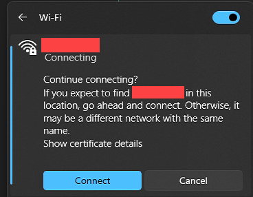

 

As of Windows 11, we noticed that we were getting prompted to continue connecting to a network that we'd never had a problem with before. It's already defined in group policy, so this new behavior is puzzling and annoying. The certificate in question is for the NPS/Radius server our network uses to validate credentials for the wifi. <figure class="wp-block-image size-large">

 </figure> 

I really had no idea how to even begin googling for this problem, but while talking to some of my fellow nerds on the [Winadmins](http://winadmins.io/) Discord server, tossing around some ideas on what could be causing this, looking to see whether there was a problem with the certificate, etc. While I was poking around and testing these suggestions I stumbled across the fix.

In the group policy editor, find the defined wifi policies under Computer -> policies > windows settings > Wireless Network (802.11) Policies. Open the properties for the configuration in question. 

On the General tab, find the SSID you've configured and click Edit. On the Security tab, under the authentication method (Microsoft: Protected EAP in my case), click properties. 

On the Protected EAP Properties tab, the checkmark for "Verify the server's identity by validating the certificate" was already checked. The fix ended up being to select the checkmark by my company's internal CA service. After updating the group policy on the laptop in question, the network connects properly on login again with no further questions.
